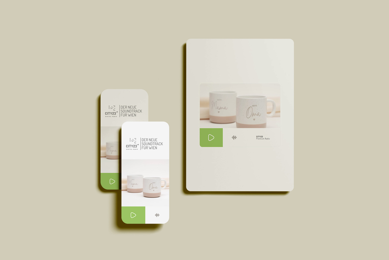

### [city23](https://city23on.vercel.app/) is a Progressive Web App (PWA) radio app.

city23 is a minimal, premium online radio player focused on chillout, lounge, pop, and disco sounds. city23 streams curated music 24/7 via a lightweight, vanilla HTML/CSS/JS player. The interface emphasizes simplicity: one hero image, a clear play/stop control, subtle animations, and responsive layout. The project is PWA‑ready, allowing users to install it as an app and enjoy quick access with native‑like behavior.

   

Live audio streaming via HTML5 `<audio>`   
One‑tap play / stop with visual state feedback   
Animated wave indicator while playing   
Responsive layout optimized for mobile and desktop   
Fast loading with minimal dependencies  
Progressive Web App (PWA) installable   
Clean, modern UI with muted colors and soft transitions   
Hero image with object‑fit cover for consistent visuals   
Tailwind v4 and Vanilla JS  

