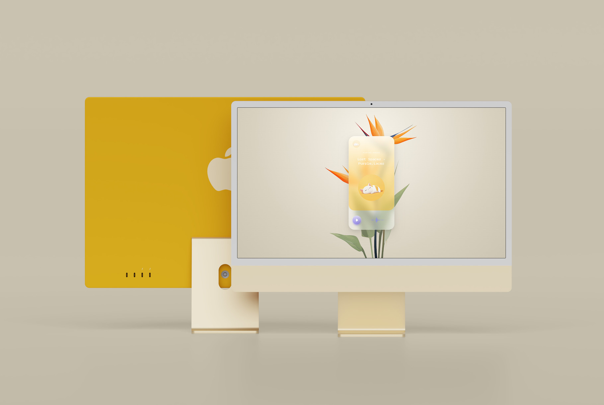

   

### [Cafe25](https://cafe25.vercel.app/) is a premium Vien city23 radio.     
  
- Radio player from Vien
- Current track information display  
- Responsive    
- Tailwind v4   
- Vanilla JS  
- Live audio visualizer    

#### Cafe25 is a radio app.

Cafe25 is a minimal, premium online radio player focused on chillout, lounge, pop, and disco sounds and streams music 24/7 via a lightweight, vanilla player.

#### Features

- Play / Pause radio stream 
- Live streaming audio   
- Current track information display   
- Real-time audio visualizer (Web Audio API)   
- Responsive mobile-friendly design   
- Lightweight – no frameworks required   
- Simple static hosting (GitHub Pages / Vercel / Netlify)  
